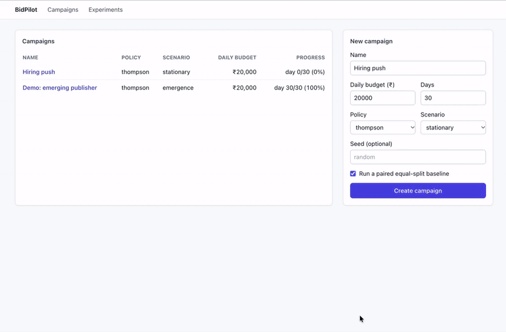
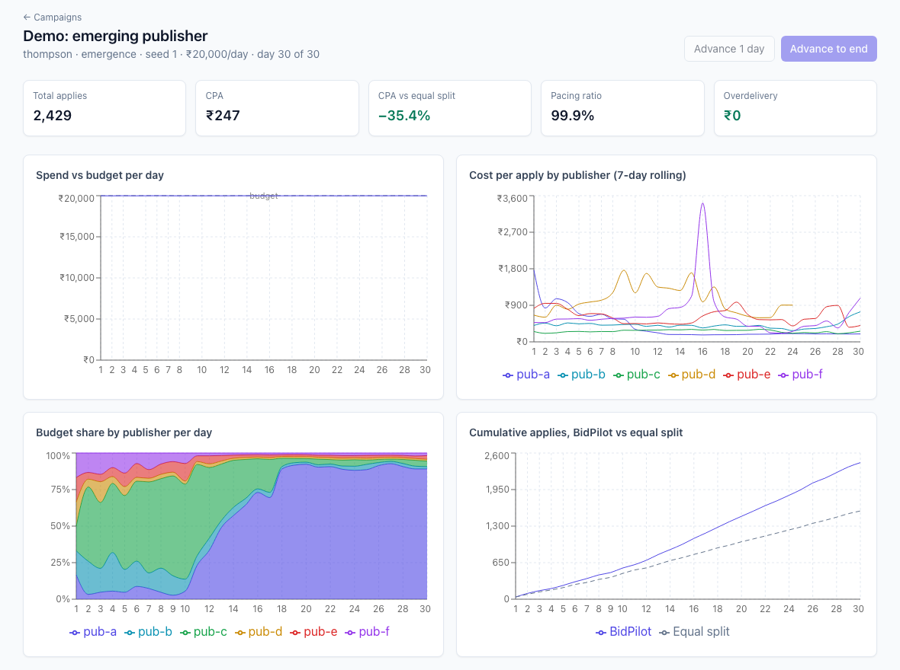
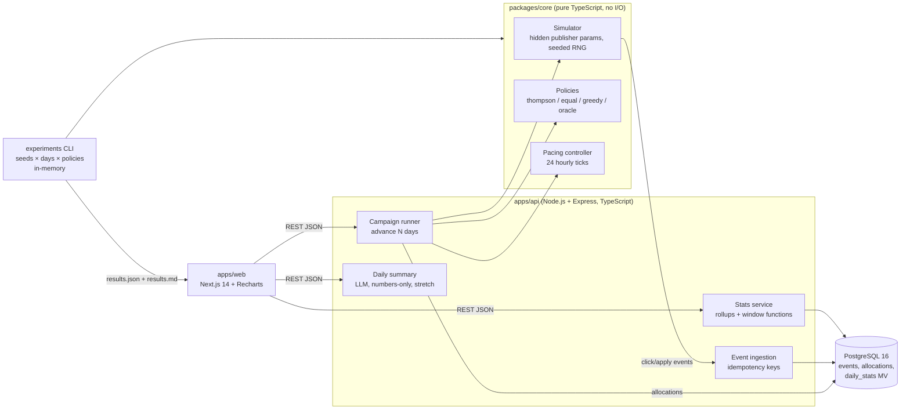

# BidPilot



Job-ad budget optimizer. A campaign has a daily budget and jobs in four categories; six job sites ("publishers")
sell clicks at different prices and turn clicks into applications at different, unknown rates. Each day BidPilot
decides how much to spend on each publisher, using Thompson sampling, paces the spend hour by hour so the day never
goes over budget, and compares itself with splitting the budget equally.

All traffic is simulated. The simulator is deterministic for a seed, so every number below can be reproduced.

**Live:** dashboard <https://bidpilot-ashen.vercel.app> · API <https://bidpilot-api-jcys.onrender.com/api/health>



The API runs on a free Render instance and sleeps when idle; the first request after a pause can take about a minute.

## Status

Feature-complete for the planned scope (tasks B01-B20 in [harness/STATE.md](harness/STATE.md)): simulator,
allocator and pacing, event API with SQL rollups, dashboard, experiments, deployment, and an optional LLM daily
summary with a grounding check. 118 automated tests run in CI (`pnpm test`).

## What is in it

- **Simulator** (`packages/core`, no I/O): 6 fictional publishers with hidden cost per click, click-to-apply rate and
  hourly click capacity per job category, daily noise, and three scenarios: `stationary`, `drift` (the best
  publisher degrades on day 15) and `emergence` (a poor publisher becomes the best on day 10).
- **Allocator:** Thompson sampling on each publisher's apply rate with a discounted Beta posterior (γ = 0.95), turned
  into budget shares with a 1% exploration floor and a cap at 1.2 × the publisher's observed click capacity.
- **Pacing:** 24 hourly ticks; never over the daily budget; money a publisher cannot use moves to publishers with
  spare clicks in the same hour.
- **Event API** (`apps/api`, Express + PostgreSQL): every click and apply is an event with a deterministic
  idempotency key, so re-running a crashed day cannot double count; rollups are a materialized view queried with
  window functions (7-day CPA, daily budget share).
- **Dashboard** (`apps/web`, Next.js + Recharts): KPI tiles, spend vs budget, 7-day CPA by publisher, budget share
  over time, cumulative applies against the paired equal-split campaign.
- **Experiments** (`experiments`, in memory): 20 seeds × 30 days × 4 policies × 3 scenarios with the same simulated
  traffic for every policy on a seed.
- **Daily summary** (optional): a short note written by a model from that day's numbers only; any figure in the text
  that is not in those numbers rejects the note in favour of a template sentence.

## Architecture



Two paths share the same core. The **live path** advances a campaign day by day through the API: each day is one
transaction that reads history back from SQL, allocates, simulates, writes allocations and events, and refreshes the
rollups. The **experiment path** runs the same day loop in memory. A parity test checks that both make identical
allocations for the same seed over 5 days. Full design: [docs/ARCHITECTURE.md](docs/ARCHITECTURE.md); decisions:
[harness/DECISIONS.md](harness/DECISIONS.md).

## Results

Copied from [experiments/results/results.md](experiments/results/results.md), generated by
`pnpm exp --seeds 20 --days 30 --scenario all --ablation` at commit `e903192` (runtime 60.0 s).

20 seeds × 30 days, ₹20,000 per day, equal job mix. Values are mean ± 95% CI across seeds (t-distribution). "CPA vs
equal" and "Beats" are paired by seed (common random numbers). Regret is applies lost versus the oracle, which knows
the hidden parameters. Thompson uses a 1% floor.

### stationary

| Policy | Applies | CPA (₹) | CPA vs equal | Regret (applies) | Beats equal | Beats greedy | Pacing | Overdelivery days |
| --- | --- | --- | --- | --- | --- | --- | --- | --- |
| equal | 1257 ± 18 | 477.6 ± 6.8 | 0.0% ± 0.0% | 525 ± 24 | 0/20 | 0/20 | 0.9993 | 0 |
| greedy | 1568 ± 52 | 375.3 ± 12.8 | -21.4% ± 2.6% | 214 ± 49 | 20/20 | 0/20 | 0.9760 | 0 |
| thompson | 1578 ± 19 | 380.3 ± 4.7 | -20.3% ± 1.4% | 204 ± 16 | 20/20 | 5/20 | 0.9993 | 0 |
| oracle | 1782 ± 21 | 334.8 ± 4.1 | -29.9% ± 1.2% | 0 ± 0 | 20/20 | 20/20 | 0.9935 | 0 |

### drift

| Policy | Applies | CPA (₹) | CPA vs equal | Regret (applies) | Beats equal | Beats greedy | Pacing | Overdelivery days |
| --- | --- | --- | --- | --- | --- | --- | --- | --- |
| equal | 1169 ± 17 | 513.3 ± 7.4 | 0.0% ± 0.0% | 448 ± 24 | 0/20 | 0/20 | 0.9993 | 0 |
| greedy | 1366 ± 34 | 427.9 ± 11.2 | -16.6% ± 2.1% | 252 ± 38 | 20/20 | 0/20 | 0.9715 | 0 |
| thompson | 1374 ± 18 | 436.7 ± 5.9 | -14.9% ± 1.3% | 244 ± 17 | 20/20 | 7/20 | 0.9993 | 0 |
| oracle | 1618 ± 23 | 361.1 ± 5.4 | -29.6% ± 1.2% | 0 ± 0 | 20/20 | 20/20 | 0.9727 | 0 |

### emergence

| Policy | Applies | CPA (₹) | CPA vs equal | Regret (applies) | Beats equal | Beats greedy | Pacing | Overdelivery days |
| --- | --- | --- | --- | --- | --- | --- | --- | --- |
| equal | 1493 ± 20 | 401.9 ± 5.3 | 0.0% ± 0.0% | 1073 ± 32 | 0/20 | 4/20 | 0.9993 | 0 |
| greedy | 1623 ± 68 | 363.7 ± 15.5 | -9.4% ± 4.1% | 943 ± 68 | 16/20 | 0/20 | 0.9760 | 0 |
| thompson | 2181 ± 47 | 275.5 ± 6.1 | -31.4% ± 1.5% | 385 ± 30 | 20/20 | 20/20 | 0.9993 | 0 |
| oracle | 2566 ± 29 | 233.3 ± 2.6 | -41.9% ± 0.9% | 0 ± 0 | 20/20 | 20/20 | 0.9973 | 0 |

What the numbers say:

- Thompson sampling beats the equal split on CPA on 20 of 20 seeds in every scenario.
- When publishers do not change (`stationary`) or the best one degrades (`drift`), greedy (3 days of equal split,
  then all-in on the best observed CPA) is slightly cheaper per apply than Thompson sampling: about ₹5-9 lower CPA,
  and lower on 15/20 and 13/20 seeds. Thompson pays for its exploration; its results vary less across seeds
  (95% CI ±₹4.7 against ±₹12.8 in `stationary`).
- When a poor publisher becomes the best (`emergence`), Thompson cuts CPA by 31.4% against the equal split and
  beats greedy on 20 of 20 seeds; greedy, committed to what it saw in the first 3 days, cuts it by 9.4%.
- No policy spent over the daily budget on any day.

The exploration-floor ablation (0%, 1%, 3%) is in [results.md](experiments/results/results.md#exploration-floor-ablation-thompson).

The demo campaign on the live dashboard (`emergence`, seed 1, 30 days) reads 2,429 applies at ₹247 per apply,
−35.4% against its equal-split pair, pacing 99.9%, overdelivery ₹0 (from `/api/campaigns/:id/stats/summary`).

## Run locally

Requirements: Node.js 20, pnpm, Docker.

```sh
sh scripts/setup.sh                                  # git identity and hooks
pnpm install
docker compose up -d                                 # Postgres 16 on port 5433
cp .env.example .env                                 # then fill DATABASE_URL and DATABASE_URL_TEST
pnpm --filter db migrate && pnpm --filter db seed
pnpm --filter api dev                                # API on http://localhost:4100
pnpm --filter web dev                                # dashboard on http://localhost:3100
```

| Purpose | Command |
| --- | --- |
| Checks | `pnpm lint && pnpm typecheck && pnpm test` |
| Experiments (writes `experiments/results/`) | `pnpm exp --seeds 20 --days 30 --scenario all` (add `--ablation` for the floor comparison) |
| CI on a fresh clone, as GitHub runs it | `sh scripts/ci-local.sh` |

Optional: set `GEMINI_API_KEY` and `GEMINI_MODEL` to have a model write the daily summaries
(`GET /api/campaigns/:id/summary/:day`); without them the API uses the template sentence. All variables:
[docs/ARCHITECTURE.md §11](docs/ARCHITECTURE.md#11-configuration).

## How real traffic would differ

Real click data is delayed (applies arrive hours or days after clicks), noisy, seasonal and sometimes fraudulent, and
publishers price clicks by auction rather than at a fixed cost per click. The simulator has none of that. Natural
extensions: correcting for delayed feedback, optimizing bids rather than only budgets, hierarchical priors that share
what is learned across similar jobs, and filtering fraud before the posterior update.

## Author

Bittu Mandal · [@ishowguts](https://github.com/ishowguts)
